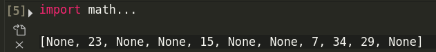
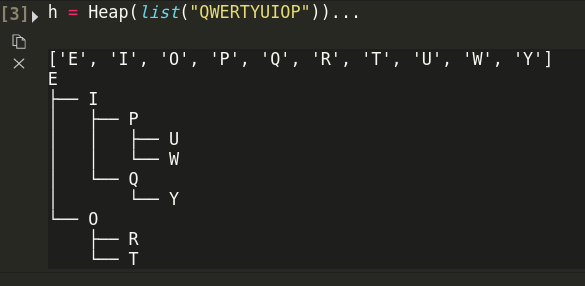
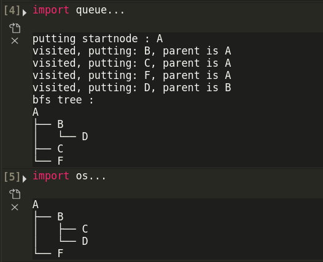
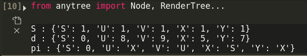
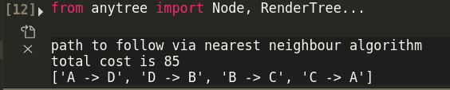

# Algorithm Implemetations
Python implementations for algorithms learnt in CZ2001-Algorithms in NTU Singapore.

Images used and implemented in the programs are linked in the code, and included in this repository.
## Topics contained
* Hash tables 
    1. Closed address hashing
    2. Open address hashing (Linear probing and double hashing)
    Contents of the hash table of specified size are shown, like so:
    
    

* Searching - Sequential and binary search
* Sorting:
    - Insertion sort, Mergesort, QuickSort.
    - HeapSort: sorted array and final heap shown. Mess around with this class to get a better feel of each of the implementations.
    
    

* Graphs:
    - BFS and DFS (cell 4 and 5 respectively, in this image. The graph we are using is present in the `bfs` and `dfs` directory)
    
    
    - Dijkstra's algorithm. Contents of S, d, and pi shown.
    ```
    S : tracks if shortest path from start node has been found
    d : distances from the start node to these vertices
    pi : stores the predecessor nodes for these vertices
    ```
    
    - Heuristic algorithms(Might not be accurate, but are close enough) - Nearest neighbour implementation for Travelling Salesman problem(TSP- minimum weight cycle)
    

>anytree used (`pip install anytree`) for visualising and implementing trees.

### Submit a pull request/ raise an issue if you find anything that's wrong/could be improved! Cheers :)
